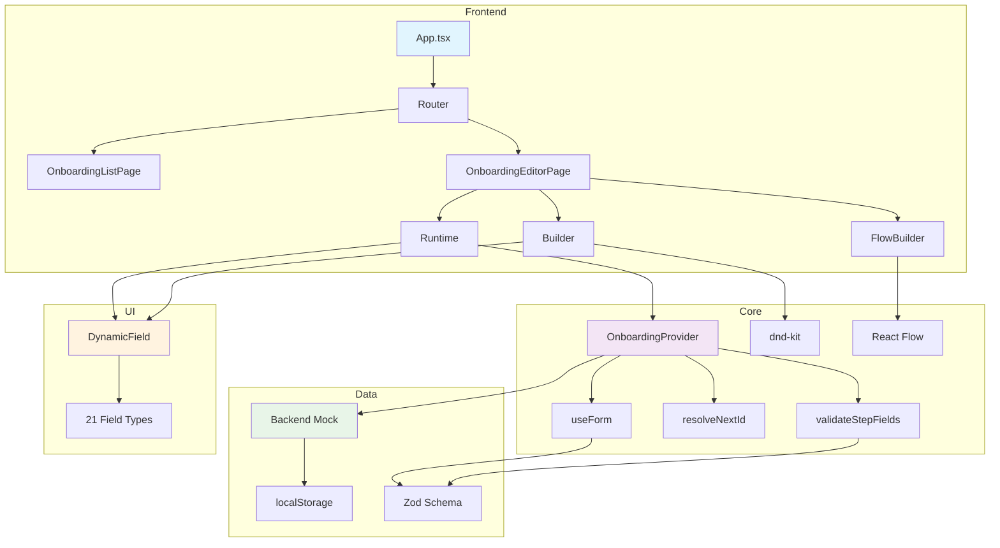
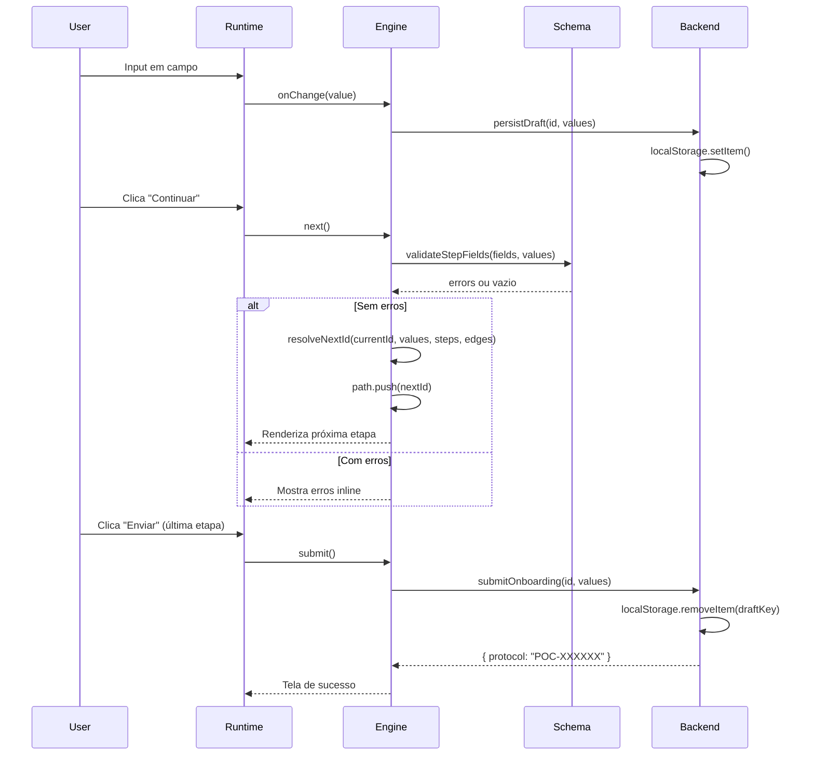
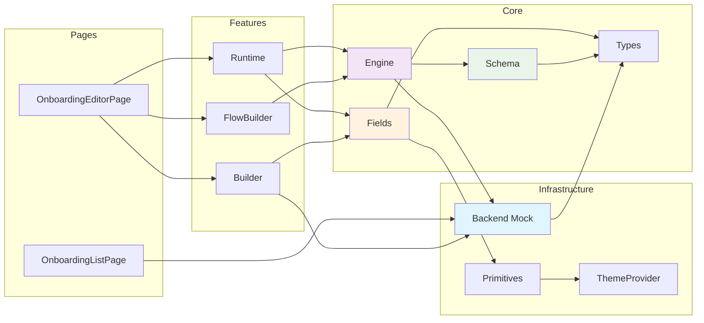

# Arquitetura do Sistema

## Diagrama de Alto Nível



## Fluxo de Dados



## Dependency Graph



## Visão Geral

```
src/
├── App.tsx                    # Shell (header + outlet + footer)
├── main.tsx                   # Entry point + RouterProvider
├── router.tsx                 # Rotas lazy-loaded
├── index.css                  # Tokens, theme, React Flow vars
│
├── onboarding/                # Core do onboarding
│   ├── types.ts               # Tipos: OnboardingConfig, FieldConfig, StepEdge
│   ├── schema.ts              # Zod: validateWithSchema, isFieldVisible
│   ├── engine.tsx             # Provider: useForm, path, resolveNextId, draft
│   ├── fields.tsx             # DynamicField (21 tipos), spanClass
│   └── Runtime.tsx            # Stepper, transições, footer, sucesso
│
├── builder/                   # Editor visual
│   └── Builder.tsx            # Paleta, canvas, propriedades, DnD
│
├── flow/                      # Fluxo em grafo
│   └── FlowBuilder.tsx        # React Flow, arestas condicionais
│
├── mocks/                     # Backend mock
│   ├── backend.ts             # CRUD, drafts, CEP, submit
│   └── backend.test.ts        # 32 testes do repositório
│
├── pages/                     # Páginas de rota
│   ├── OnboardingListPage.tsx # Lista, modal criação, exclusão
│   └── OnboardingEditorPage.tsx # Editor com abas
│
├── components/ui/             # Primitivos de UI
│   └── primitives.tsx         # Button, Card, Input, Badge, Alert, etc.
│
├── theme/                     # Tema
│   └── ThemeProvider.tsx       # Dark/light/sistema, persistência
│
└── lib/                       # Utilitários
    ├── utils.ts               # cn(), parseBR(), uid(), masks
    └── utils.test.ts          # 3 testes de máscaras
```

## Dependency Graph

```
router.tsx
  └─ App.tsx (shell)
       ├─ OnboardingListPage.tsx
       │    └─ backend.ts (CRUD)
       └─ OnboardingEditorPage.tsx
            ├─ Builder.tsx
            │    ├─ fields.tsx (DynamicField)
            │    ├─ backend.ts (save/load)
            │    └─ dnd-kit (drag-and-drop)
            ├─ FlowBuilder.tsx (lazy)
            │    ├─ @xyflow/react
            │    └─ engine.tsx (findCycle)
            └─ Runtime.tsx
                 ├─ engine.tsx (OnboardingProvider)
                 │    ├─ useForm (react-hook-form)
                 │    ├─ schema.ts (validateStepFields)
                 │    └─ backend.ts (draft/submit)
                 └─ fields.tsx (DynamicField)
```

## Data Flow

### 1. Carregamento

```
localStorage → readCollection() → OnboardingConfig[]
    ↓
OnboardingEditorPage → fetchOnboardingConfig(id)
    ↓
OnboardingProvider → useForm({ defaultValues })
    ↓
Runtime renderiza campos via Controller/FieldControl
```

### 2. Validação

```
User input → useWatch (react-hook-form)
    ↓
onChange → persistDraft (localStorage)
    ↓
Continuar → validateStepFields(fields, values)
    ↓
errors vazios → resolveNextId(currentId, values, steps, edges)
    ↓
path.push(nextId) → stepper atualiza
```

### 3. Submissão

```
Etapa final → validateStepFields (todos os campos visitados)
    ↓
submitOnboarding(config.id, values)
    ↓
localStorage.removeItem(draftKey)
    ↓
Tela sucesso com protocolo POC-XXXXXX
```

## Engine: resolveNextId

```typescript
function resolveNextId(currentId, values, steps, edges): string | null {
  // 1. Arestas condicionais (na ordem) que batem
  for (const edge of conditionalEdges) {
    if (whenMatches(edge.when, values)) return edge.to;
  }
  
  // 2. Primeira aresta "sempre"
  const always = edges.find(e => !e.when);
  if (always) return always.to;
  
  // 3. Fallback linear
  const idx = steps.findIndex(s => s.id === currentId);
  return steps[idx + 1]?.id ?? null;
}
```

## Builder: Estrutura

```
Builder
├── Toolbar (Etapa, Salvar, Restaurar, Exportar, Importar, Toggle Device)
├── Grid 3 colunas
│   ├── Paleta (21 tipos em 3 grupos)
│   ├── Canvas
│   │   ├── Mobile: frame 400px com DeviceFrame
│   │   └── Desktop: largura total
│   │       └── CanvasList
│   │           └── SortableFieldRow (por etapa)
│   │               └── DynamicField (preview disabled)
│   └── Propriedades (lg:sticky)
│       ├── StepProps (título, descrição, colunas, skippable)
│       └── FieldProps (label, placeholder, opções, showIf, etc.)
```

## Backend Mock: API

| Função | Método | Descrição |
|---|---|---|
| `listOnboardings()` | GET | Retorna coleção |
| `createOnboarding(title)` | POST | Cria novo com ID único |
| `deleteOnboarding(id)` | DELETE | Remove da coleção |
| `fetchOnboardingConfig(id?)` | GET | Busca config por ID |
| `saveOnboardingConfig(config)` | PUT | Salva com version+1 |
| `resetOnboardingConfig(id?)` | PUT | Restaura padrão |
| `submitOnboarding(id, values)` | POST | Simula envio (erro se "erro" no e-mail) |
| `lookupCep(cep)` | GET | Mock ViaCEP |
| `checkEmailAvailable(email)` | GET | Sempre true |
| `loadDraft(id)` | GET | Rascunho do usuário |
| `persistDraft(id, values)` | PUT | Salva rascunho |

## State Management

- **react-hook-form** para formulário (useForm + useWatch)
- **useState** local para UI state (selStep, selField, device, etc.)
- **localStorage** para persistência (config, drafts, theme)
- **React Context** para OnboardingProvider (engine)
- Sem Redux/Zustand — estado é local e derivado

## Bundle

| Chunk | Tamanho | Conteúdo |
|---|---|---|
| `index.js` | ~355 kB | React, ReactDOM, utils |
| `OnboardingEditorPage.js` | ~162 kB | Editor completo |
| `FlowBuilder.js` | ~192 kB | React Flow (lazy) |
| `Builder.js` | ~65 kB | Builder + DnD |
| `index.css` | ~34 kB | Tailwind + tokens |

Total: ~808 kB ( gzip ~241 kB )
