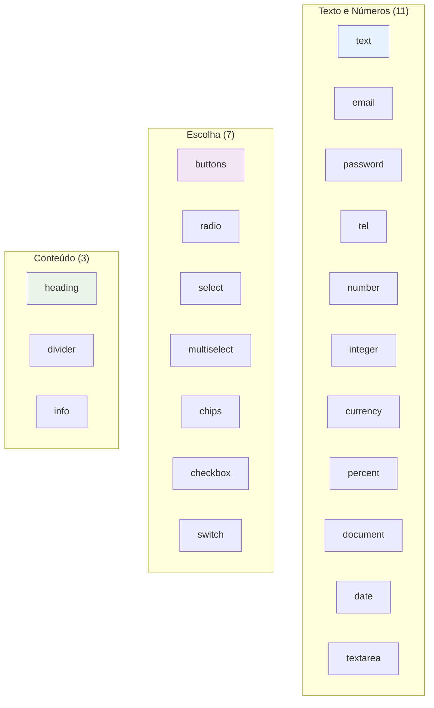

# Tipos de Campo (21)

Guia completo dos 21 tipos de campo disponíveis no `DynamicField`.

## Visão Geral



## Grupo 1: Texto e Números (11)

### 1. text

Input de texto genérico.

```json
{
  "id": "name",
  "type": "text",
  "label": "Nome completo",
  "placeholder": "Ex.: Maria Silva",
  "required": true,
  "desktopSpan": 6
}
```

**Validação**: String, minLength opcional.

---

### 2. email

Input com validação de e-mail.

```json
{
  "id": "email",
  "type": "email",
  "label": "E-mail",
  "placeholder": "voce@empresa.com",
  "required": true,
  "desktopSpan": 6
}
```

**Validação**: Regex `^[^\s@]+@[^\s@]+\.[^\s@]+$`.

---

### 3. password

Input de senha (mostra/oculta).

```json
{
  "id": "password",
  "type": "password",
  "label": "Senha",
  "placeholder": "Mín. 8 caracteres",
  "required": true,
  "minLength": 8,
  "desktopSpan": 6
}
```

**Validação**: String, minLength opcional.

---

### 4. texttel

Input de telefone com máscara BR.

```json
{
  "id": "phone",
  "type": "tel",
  "label": "Celular / WhatsApp",
  "placeholder": "(11) 99999-9999",
  "required": true,
  "desktopSpan": 6
}
```

**Validação**: String, inputMode="tel".

---

### 5. number

Input numérico (decimais permitidos).

```json
{
  "id": "amount",
  "type": "number",
  "label": "Valor",
  "placeholder": "0.00",
  "desktopSpan": 6
}
```

**Validação**: String, inputMode="numeric".

---

### 6. integer

Input de números inteiros (sem decimais).

```json
{
  "id": "seats",
  "type": "integer",
  "label": "Nº de assentos",
  "placeholder": "10",
  "desktopSpan": 6
}
```

**Validação**: Regex `^-?\d+$`.

---

### 7. currency

Input de moeda com máscara R$.

```json
{
  "id": "revenue",
  "type": "currency",
  "label": "Faturamento mensal (R$)",
  "placeholder": "0,00",
  "desktopSpan": 6
}
```

**Validação**: parseBR (R$ 1.234,56 → 1234.56).

**Comportamento**: Prefixo "R$" fixo à esquerda. Formatação automática: `5000000` → `50.000,00`.

---

### 8. percent

Input de percentual (0–100) com sufixo %.

```json
{
  "id": "discount",
  "type": "percent",
  "label": "Desconto desejado (%)",
  "placeholder": "0",
  "desktopSpan": 6
}
```

**Validação**: 0 ≤ valor ≤ 100 (parseBR).

**Comportamento**: Sufixo "%" fixo à direita.

---

### 9. document

Input de CPF/CNPJ com máscara automática.

```json
{
  "id": "cpf",
  "type": "document",
  "label": "CPF",
  "placeholder": "000.000.000-00",
  "required": true,
  "desktopSpan": 6,
  "showIf": { "field": "account_kind", "equals": "pf" }
}
```

**Validação**: 11 dígitos (CPF) ou 14 dígitos (CNPJ).

**Comportamento**: Detecta automaticamente CPF vs CNPJ e mostra label "Detectado: CPF" ou "Detectado: CNPJ".

---

### 10. date

Input de data (native date picker).

```json
{
  "id": "birth",
  "type": "date",
  "label": "Data de nascimento",
  "desktopSpan": 6
}
```

**Validação**: String, inputMode="date".

---

### 11. textarea

Área de texto multi-linha.

```json
{
  "id": "bio",
  "type": "textarea",
  "label": "Bio curta",
  "placeholder": "O que você faz, em 1–2 frases…",
  "desktopSpan": 12
}
```

**Validação**: String, minLength opcional.

---

## Grupo 2: Escolha (7)

### 12. buttons

Escolha única em botões grandes (cards). Padrão mobile.

```json
{
  "id": "account_kind",
  "type": "buttons",
  "label": "Você é",
  "required": true,
  "desktopSpan": 12,
  "options": [
    { "value": "pf", "label": "Pessoa física" },
    { "value": "pj", "label": "Empresa (PJ)" }
  ]
}
```

**Validação**: String (value selecionado).

**Comportamento**: Radio group com roving tabindex. Setas/Home/End navegam. Seleção visual com check.

---

### 13. radio

Escolha única em pills compactas.

```json
{
  "id": "plan_kind",
  "type": "radio",
  "label": "Plano",
  "required": true,
  "desktopSpan": 12,
  "options": [
    { "value": "free", "label": "Free — para testar" },
    { "value": "pro", "label": "Pro — R$ 49/mês" },
    { "value": "enterprise", "label": "Enterprise — fale com a gente" }
  ]
}
```

**Validação**: String (value selecionado).

**Comportamento**: Pills inline com radio group. Mais compacto que buttons.

---

### 14. select

Dropdown nativo.

```json
{
  "id": "role",
  "type": "select",
  "label": "Seu papel",
  "required": true,
  "desktopSpan": 6,
  "options": [
    { "value": "dev", "label": "Dev" },
    { "value": "design", "label": "Design" },
    { "value": "pm", "label": "Produto" },
    { "value": "outro", "label": "Outro" }
  ]
}
```

**Validação**: String (value selecionado).

---

### 15. multiselect

Múltipla escolha em cards com checkbox.

```json
{
  "id": "skills",
  "type": "multiselect",
  "label": "Habilidades",
  "desktopSpan": 12,
  "options": [
    { "value": "react", "label": "React" },
    { "value": "vue", "label": "Vue" },
    { "value": "angular", "label": "Angular" }
  ]
}
```

**Validação**: Array de strings.

**Comportamento**: Grid 2 colunas (sm:grid-cols-2). Checkbox visual com check.

---

### 16. chips

Múltipla escolha em chips inline.

```json
{
  "id": "interests",
  "type": "chips",
  "label": "Temas de interesse",
  "desktopSpan": 12,
  "options": [
    { "value": "ia", "label": "IA" },
    { "value": "mobile", "label": "Mobile" },
    { "value": "ux", "label": "UX" },
    { "value": "dados", "label": "Dados" },
    { "value": "cloud", "label": "Cloud" }
  ]
}
```

**Validação**: Array de strings.

**Comportamento**: Pills inline com toggle. Mais compacto que multiselect.

---

### 17. checkbox

Checkbox simples (boolean).

```json
{
  "id": "lgpd",
  "type": "checkbox",
  "label": "Li e aceito a Política de Privacidade",
  "required": true,
  "desktopSpan": 12
}
```

**Validação**: Boolean. Se required, deve ser `true`.

**Comportamento**: Label ao lado do checkbox. Sem input separado.

---

### 18. switch

Toggle on/off (boolean).

```json
{
  "id": "newsletter",
  "type": "switch",
  "label": "Receber novidades por e-mail",
  "defaultValue": true,
  "desktopSpan": 12
}
```

**Validação**: Boolean.

**Comportamento**: Toggle visual com animação. Label à esquerda, toggle à direita.

---

## Grupo 3: Conteúdo (3)

### 19. heading

Título ou subtítulo de seção (display, sem valor).

```json
{
  "id": "account_head",
  "type": "heading",
  "label": "Dados básicos",
  "content": "Usados para criar seu acesso.",
  "headingLevel": "title",
  "desktopSpan": 12
}
```

**Validação**: Nenhuma (não é campo de input).

**Opções de `headingLevel`**:
- `"title"`: `<h3>` com fonte maior e bold
- `"subtitle"`: `<p>` com fonte menor e muted

---

### 20. divider

Linha separadora opcional com legenda.

```json
{
  "id": "sep1",
  "type": "divider",
  "label": "OU",
  "desktopSpan": 12
}
```

**Validação**: Nenhuma.

**Comportamento**: Separador horizontal. Se tiver label, mostra centralizado com linhas aos lados.

---

### 21. info

Caixa de informação com ícone.

```json
{
  "id": "info1",
  "type": "info",
  "label": "Importante",
  "content": "Seus dados são criptografados e não são compartilhados.",
  "desktopSpan": 12
}
```

**Validação**: Nenhuma.

**Comportamento**: Card com ícone ℹ️ à esquerda. Fundo `muted/60`.

---

## Propriedades Comuns

| Propriedade | Tipo | Obrigatório | Descrição |
|---|---|---|---|
| `id` | string | Sim | ID único do campo |
| `type` | FieldType | Sim | Tipo do campo |
| `label` | string | Sim | Rótulo exibido |
| `placeholder` | string | Não | Placeholder do input |
| `help` | string | Não | Texto de ajuda abaixo do campo |
| `required` | boolean | Não | Se true, campo obrigatório |
| `options` | FieldOption[] | Não | Opções para select/radio/buttons/chips/multiselect |
| `defaultValue` | string \| boolean \| string[] | Não | Valor inicial |
| `desktopSpan` | 4 \| 6 \| 8 \| 12 | Não | Largura no desktop (grid 12) |
| `showIf` | ShowIf | Não | Condição de visibilidade |
| `minLength` | number | Não | Tamanho mínimo (text/password) |
| `content` | string | Não | Conteúdo para heading/info |
| `headingLevel` | "title" \| "subtitle" | Não | Estilo do heading |

## Validação por Tipo

| Tipo | Validação | Mensagem de Erro |
|---|---|---|
| `text` | String, minLength | "Mínimo de X caracteres." |
| `email` | Regex | "E-mail inválido." |
| `password` | String, minLength | "Mínimo de X caracteres." |
| `tel` | String | — |
| `number` | String | — |
| `integer` | Regex `^-?\d+$` | "Use apenas números inteiros." |
| `currency` | parseBR | "Valor inválido." |
| `percent` | 0–100 | "Use um valor entre 0 e 100." |
| `document` | 11 ou 14 dígitos | "CPF/CNPJ incompleto." |
| `date` | String | — |
| `textarea` | String, minLength | "Mínimo de X caracteres." |
| `select` | String | — |
| `radio` | String | — |
| `buttons` | String | — |
| `checkbox` | Boolean | "Confirmação obrigatória." |
| `switch` | Boolean | — |
| `multiselect` | Array | — |
| `chips` | Array | — |
| `heading` | — | — |
| `divider` | — | — |
| `info` | — | — |

## Autocomplete Automático

O `DynamicField` define `autoComplete` automaticamente baseado no `type` e `id`:

| Condição | autoComplete |
|---|---|
| `type=email` ou `id` contém "email" | `email` |
| `type=tel` ou `id` contém "phone"/"cel"/"whats" | `tel` |
| `type=password` | `new-password` |
| `id=name` ou contém "nome"/"full" | `name` |
| `id=cep` ou contém "postal"/"zip" | `postal-code` |
| `id=city` ou contém "cidade" | `address-level2` |
| `id=uf` ou contém "estado"/"state" | `address-level1` |
| `id` contém "street"/"rua"/"avenida" | `street-address` |
| `id` contém "birth"/"nasc" | `bday` |
| `id` contém "company"/"empresa"/"razao" | `organization` |

## Exemplo Completo: Etapa "Conta"

```json
{
  "id": "account",
  "title": "Conta",
  "description": "Dados básicos de acesso.",
  "desktopColumns": 2,
  "fields": [
    {
      "id": "account_head",
      "type": "heading",
      "label": "Dados básicos",
      "content": "Usados para criar seu acesso.",
      "desktopSpan": 12
    },
    {
      "id": "name",
      "type": "text",
      "label": "Nome completo",
      "placeholder": "Ex.: Maria Silva",
      "required": true,
      "desktopSpan": 6
    },
    {
      "id": "email",
      "type": "email",
      "label": "E-mail",
      "placeholder": "voce@empresa.com",
      "required": true,
      "desktopSpan": 6
    },
    {
      "id": "password",
      "type": "password",
      "label": "Senha",
      "placeholder": "Mín. 8 caracteres",
      "required": true,
      "minLength": 8,
      "desktopSpan": 6
    },
    {
      "id": "phone",
      "type": "tel",
      "label": "Celular / WhatsApp",
      "placeholder": "(11) 99999-9999",
      "required": true,
      "desktopSpan": 6
    },
    {
      "id": "cpf",
      "type": "document",
      "label": "CPF",
      "placeholder": "000.000.000-00",
      "required": true,
      "desktopSpan": 6,
      "showIf": { "field": "account_kind", "equals": "pf" }
    },
    {
      "id": "company",
      "type": "text",
      "label": "Razão social",
      "placeholder": "Ex.: Acme LTDA",
      "required": true,
      "desktopSpan": 6,
      "showIf": { "field": "account_kind", "equals": "pj" }
    },
    {
      "id": "cnpj",
      "type": "text",
      "label": "CNPJ",
      "placeholder": "00.000.000/0001-00",
      "desktopSpan": 6,
      "showIf": { "field": "account_kind", "equals": "pj" }
    }
  ]
}
```
